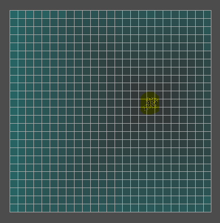
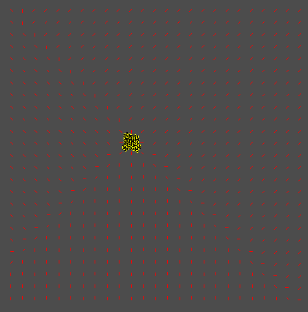
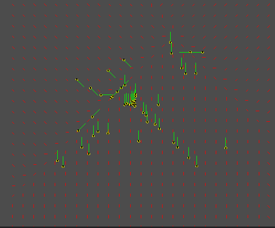
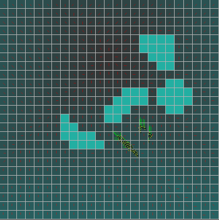
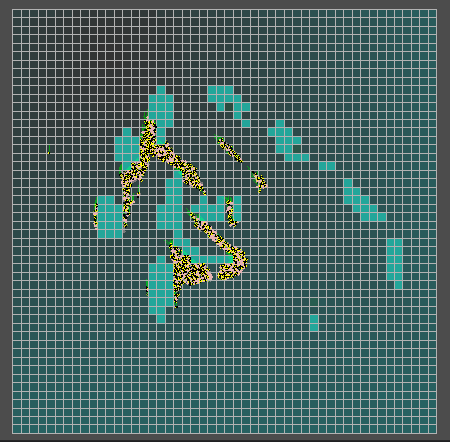

# Flow fields

## Description
This is an implementation on Flow Fields but what are they? 
Flow Fields are a solution to the pathfinding problem.
Regular pathfinding requires each pathfinder to calculate a path to reach the end.
Instead we calculate the path to the end goal for every position the pathfinder can be in.
Then the pathfinder has to just use the pre-calculated paths to the goal.

This is mostly used for large groups of pathfinders since this is more efficient.

## Implementation
The way I implemented the flow fields was by following three steps.
1. Generate a heatmap
1. Use the heatmap to generate a vector field
1. Pathfinder uses vectorfield to move

###  1. Generate heatmap
To generate a heatmap you use a pathfinding algorithm to go over all the nodes on the grid map that the pathfinder can traverse.
You start at the target and give that node the value of 0.
From that node you let the pathfinding algorythm traverse all other nodes till there are no nodes left. 
Each traversed node gets the value of the previos node +1.

The algorythm I used to traverse the nodes was Breadth-first search (BFS) that explores all of the neighbor nodes before moving on to the next nodes.
Since we don't have to prioritise any nodes we can just start from the target and go outwards.

You can visualise a heatmap by coloring the nodes based on the value you assigned them. 
It should result in something like this:
 - Pathfinders are yellow
 - The closer to the target, the less blue the nodes get.

###  2. Generate vector field 
Now that we have a heatmap we can use it to generate a vector field.
Each vector for each node should point towards the target or towards the direction that the pathfinder has to follow to reach the target.
You can do this by creating a vector for each node that points to the neighboring node with the lowest value.

You can visualise this by drawing the generated vector in each node.
It should result in something like this:
 - Pathfinders are yellow
 - The direction vector for each node is red
 - They all point in the general direction of the target or the path towards the target.
 
 

###  3. Movement
Now that we have a vector field, our pathfinders just need to use it.
Every frame you check for each pathfinder in what node they reside and give them a direction based on the vector field value. 

By drawing the direction for each pathfinder you can see if they properly use the vector field.
It should result in something like this:
 - Pathfinders are yellow
 - The pathfinder direction is green
 - They use the same direction vector as the node they walk on.
 

## Result
My implementation let's me:
 - set a target for the pathfinders 
 - makes the pathfinders go to the target
 - place walls to make paths more complex
 
 
 
 scalability: 
 - Increasing the pathfinders doesn't reduce efficiency too much.
 - Increasing map size creates larger lag spikes when changing target or envirement
   since the heatmap and vector field need to be regenerated.
 
 

## Conclusion
Flow Fields are a very good way to do pathfinding for a lot of pathfinders.
It scales well when increasing the amount of pathfinders.
It does create spikes of lag if we use a large map and recalculate the target or change the envirement.

If you need a large group of pathfinders to go somewhere, this is a great way to use flow fields.

